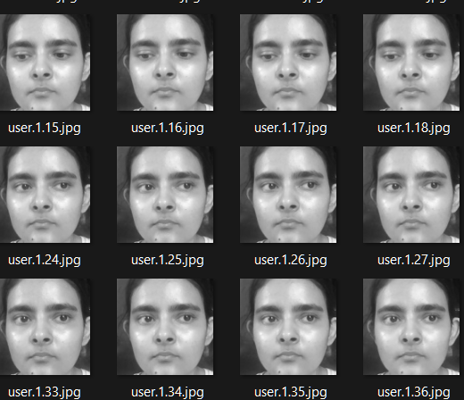
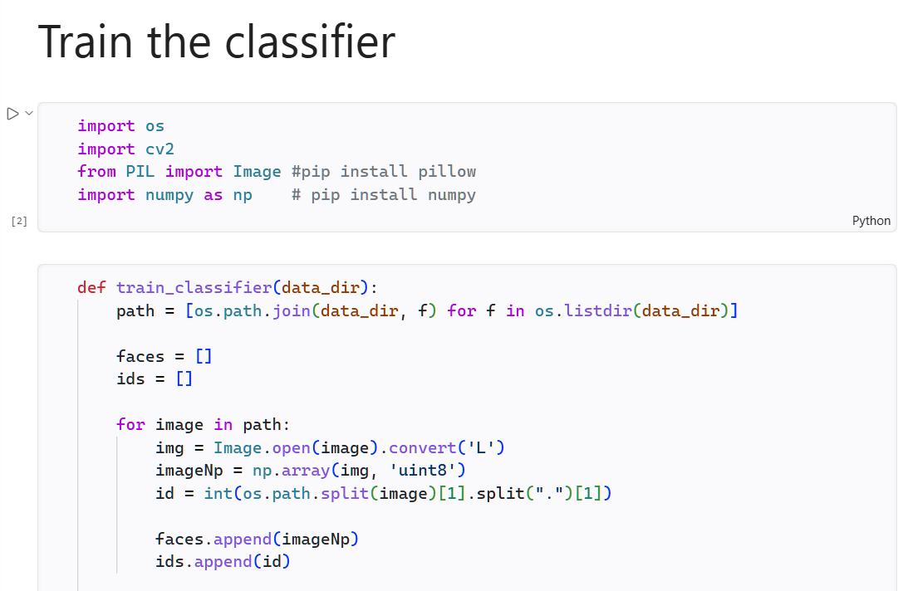
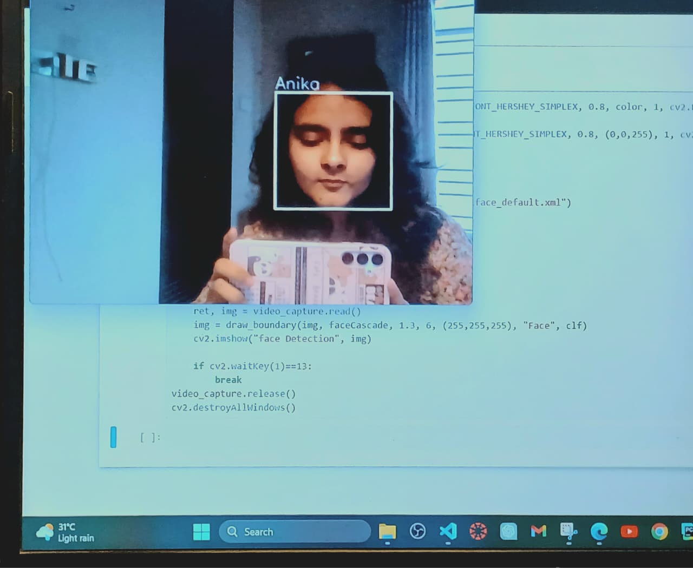

# 🎭 Face Recognition System using OpenCV & Python


A real-time **Face Detection & Recognition System** built using **Python, OpenCV, Haar Cascade, and LBPH Face Recognizer**.

This project captures facial datasets from a webcam, trains a classifier model, and performs live face recognition.

---

# ✨ Features

✅ Face Dataset Generation

✅ Automatic Person ID Creation

✅ Haar Cascade Face Detection

✅ LBPH Face Recognition Model

✅ Real-time Webcam Recognition

✅ Unknown Face Detection

---

# 📂 Project Structure

```txt
Face-recognizer/
│
├── data/
│   ├── user.1.1.jpg
│   ├── user.1.2.jpg
│   └── ...
│
├── classifier.xml
├── haarcascade_frontalface_default.xml
├── face-recogniser.ipynb
└── README.md
```

---

# ⚙️ Technologies Used

- Python
- OpenCV
- NumPy
- Pillow
- Jupyter Notebook

---

# 🚀 Installation

Clone the repository:

```bash
git clone https://github.com/YOUR_USERNAME/Face-recognizer.git
```

Move into project directory:

```bash
cd Face-recognizer
```

Install dependencies:

```bash
pip install opencv-python
pip install opencv-contrib-python
pip install numpy
pip install pillow
```

---

# ▶️ How To Run

## Step 1 — Generate Dataset

Run the dataset generation section from:

```txt
face-recogniser.ipynb
```

The webcam will open and automatically:

- Detect face
- Capture samples
- Save images inside `data/`

Example:

```txt
data/user.1.1.jpg
data/user.1.2.jpg
```

---

## Step 2 — Train Classifier

Run:

```python
train_classifier("data")
```

This creates:

```txt
classifier.xml
```

---

## Step 3 — Start Face Recognition

Run the recognition section inside:

```txt
face-recogniser.ipynb
```

The webcam will:

✔ Detect face

✔ Predict identity

✔ Show recognized person's name

✔ Mark unknown faces

---

# 🖼️ Project Demo

## Dataset Collection

Upload your screenshot here.

```txt
images/dataset_capture.png
```

Example:



---

## Model Training

Upload training screenshot.

```txt
images/training.png
```

Example:



---

## Face Recognition Output

Upload recognition screenshot.

```txt
images/recognition.png
```

Example:




# 🧠 How It Works

### Face Detection

Uses **Haar Cascade Classifier** to detect faces from webcam frames.

### Dataset Creation

Captured face images are stored inside:

```txt
data/
```

### Training

Uses **LBPH (Local Binary Pattern Histogram)** recognizer.

### Recognition

Model predicts:

- Known person → Display Name
- Unknown person → Display "UNKNOWN"

---

# 🔮 Future Improvements

- GUI Interface
- Deep Learning Recognition
- Database Integration
- Attendance System
- Multiple Face Tracking

---

# 🤝 Contributing

Contributions are welcome.

Fork the repository.

Create your feature branch.

Submit a Pull Request.

---

# 📜 License

This project is open source under the MIT License.

---

# 👩‍💻 Author

**Anika**

Computer Science & Engineering Student

GitHub: https://github.com/Anika2121
